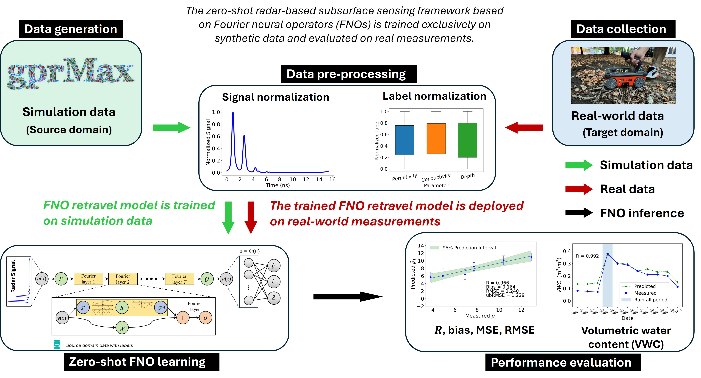

# Zero-Shot GPR-Based Subsurface Sensing with Resolution- and Domain-Invariant Fourier Neural Operators

This repository provides the source code and experimental data associated with the manuscript

**"Zero-Shot GPR-Based Subsurface Sensing with Resolution- and Domain-Invariant Fourier Neural Operators"**

by Zixin Wang, Ishfaq Aziz, and Mohamad Alipour.

The study develops a zero-shot ground-penetrating radar (GPR)-based subsurface sensing framework using Fourier neural operators (FNOs). The proposed FNO is trained exclusively on synthetic GPR data generated through finite-difference time-domain (FDTD) simulations and is subsequently evaluated on real-world GPR measurements without using target-domain data during training.

By learning spectral weights in the Fourier domain and emphasizing dominant low-frequency modes associated with physical wave propagation, the FNO provides temporal resolution invariance and robustness to discrepancies between synthetic and real GPR data. The framework is evaluated using laboratory and field experiments involving both single-layer and two-layer subsurface material configurations.

## Framework Overview



The proposed framework consists of four main stages:

1. **Data collection:** Synthetic GPR signals are generated using FDTD simulations implemented in gprMax, while real-world GPR measurements are collected from laboratory and field experiments.

2. **Data preprocessing:** The amplitude envelope of each GPR A-scan is obtained using the Hilbert transform and normalized to the range [0, 1]. Material-property labels are independently normalized using min–max normalization.

3. **Zero-shot FNO learning:** The FNO is trained exclusively on synthetic GPR data to estimate subsurface material properties, including relative permittivity, electrical conductivity, and layer depth.

4. **Performance evaluation:** The trained FNO is directly evaluated on real-world GPR measurements. Performance is assessed using the Pearson correlation coefficient (R), bias, root mean squared error (RMSE), and unbiased root mean squared error (ubRMSE). The framework is also evaluated in terms of resolution invariance, robustness to domain discrepancies, and computational efficiency.

For the field experiments, soil moisture variation is additionally evaluated in terms of volumetric water content (VWC).

## Repository Contents

The repository is organized according to the four experimental
configurations investigated in the study:

-   `Laboratory_Single_Layer_Material/`
    -   `Data/` --- Synthetic data-generation notebook and experimental
        GPR data for the laboratory single-layer material.
    -   `Model/` --- CNN, DANN, MiTSformer, and FNO model notebooks.
-   `Laboratory_Two_Layer_Material/`
    -   `Data/` --- Synthetic data-generation notebook and experimental
        GPR data for the laboratory two-layer material.
    -   `Model/` --- CNN, DANN, and FNO model notebooks.
-   `Field_Single_Layer_Material/`
    -   `Data/` --- Synthetic data-generation notebook and experimental
        field GPR data for the single-layer material.
    -   `Model/` --- CNN, DANN, and FNO model notebooks.
-   `Field_Two_Layer_Material/`
    -   `Data/` --- Synthetic data-generation notebook for the field
        two-layer material.
    -   `Model/Soil_Leaves/` --- CNN, DANN, and FNO model notebooks
        for the soil-leaves configuration.
    -   `Model/Soil_Woodchips/` --- CNN, DANN, and FNO model
        notebooks for the soil-woodchips configuration.
-   `Framework_Overview.jpg` --- Overview of the proposed framework.

## Models

The study investigates the following data-driven approaches:

- **1D CNN:** One-dimensional convolutional neural network baseline.

- **DANN:** Domain adversarial neural network baseline.

- **MiTSformer:** A Transformer-based time-series regression baseline.

- **FNO:** The proposed Fourier neural operator model.

The corresponding model files are located within the `Model/` directories
of each material configuration.

## Synthetic Data Generation

Synthetic GPR data are generated using the finite-difference time-domain
(FDTD) method implemented in **gprMax**. Data-generation notebooks are
provided within the `Data/` directory of each material configuration.

## Experimental Data

Experimental GPR data are provided for the laboratory single-layer,
laboratory two-layer, field single-layer, and field two-layer material configurations.
The corresponding data files are located within the `Data/` directories
of these configurations.

## Requirements

The code is implemented in Python. Major dependencies include:

- PyTorch
- neuraloperator
- NumPy
- pandas
- SciPy
- scikit-learn
- Matplotlib
- gprMax

Additional dependencies may be required by individual notebooks.

## Installation

Install the required Python packages as needed.

The FNO implementation uses the **NeuralOperator** library. It can be installed using:

```bash
pip install neuraloperator
```

Other commonly required packages can be installed using:

```bash
pip install numpy pandas scipy scikit-learn matplotlib
```

PyTorch should be installed according to the user's operating system and computing environment.

For synthetic GPR data generation, install and configure **gprMax** following its official installation instructions.

## Usage

The notebooks provide the main workflows for synthetic data generation,
model training, and model evaluation. Users should update local file
paths in the notebooks as needed before execution.

For the proposed FNO model, the NeuralOperator implementation is imported using:

```python
from neuralop.models import FNO
```

## Citation

If you use the code or data in this repository, please cite:

**Zixin Wang, Ishfaq Aziz, and Mohamad Alipour,  
"Zero-Shot GPR-Based Subsurface Sensing with Resolution- and Domain-Invariant Fourier Neural Operators."**

Full bibliographic information will be added upon publication.